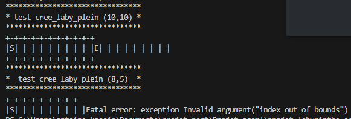
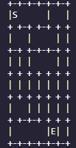
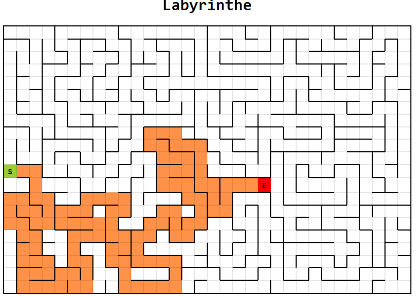

# Projet Labyrinthe en OCaml

### Binôme
- Membre 1: El-Kassis Antoine
- Membre 2: Lalaoui Rayan

## Répartition du Travail
Pour la répartition des tâches, on a essayé de faire en sorte qu'elle soit la plus équitable possible sans que chacun ait à implémenter du code pour chaque partie du projet (génération, résolution, affichage), ce qui reviendrait à faire le projet deux fois. On s'est donc réparti les tâches comme suit :
- Rayan :
    - Implémentation de la structure de base
    - Génération
    - Affichage avancé
- Antoine :
    - Résolution
    - Lecture de Labyrinthe
    - Affichage simple

Les tâches "mineures" telles que l'écriture de tests et les éventuelles debuggings ont été menées par l'un ou l'autre suivant les besoins du projet et les disponibilités de chacun. Cela nous a permis de développer une meilleure compréhension du code de l'autre tout au long du projet.

Cette répartition est aussi très utile car elle limite les conflits de versions Git étant donné que l'on a travaillé sur des fichiers différents pour la grande partie du projet. Vers la fin, où il a fallu mieux nous coordonner dans les modifications apportées que ce soit à maze.ml ou aux différents fichiers pour les rectifications avant le rendu final.

## Structure de Données

### Modèle du Labyrinthe
On a été tenté de penser au début que la meilleure implémentation serait celle du graphe "classique", c'est-à-dire des nœuds représentés par un identifiant et leurs listes de connexions, puis un type graphe qui serait une liste de nœuds. L'inconvénient majeur était que l'on ne tire pas profit du fait que les cases d'un labyrinthe ont une position fixe, et donc on pourrait accéder à n'importe quelle case à partir du type graphe sans avoir à parcourir l'intégralité des connexions (on ajouterait un facteur linéaire à la complexité). Ceci nous a poussés à ajuster cette idée d'implémentation. Dans un souci de modularité, nous avons 3 types qui permettent de représenter nos labyrinthes.
### Type Ocaml

#### Node
- TYPE:
    ```ocaml
    type node =  {id : int*int ; connexions : node list ; visite : bool}
    ```
    - `id` : Une paire représentant l'identifiant unique du nœud (position dans la grille).
    - `connexions` : Une liste de nœuds avec lesquels il est connectés.
    - `visite` : Un booléen indiquant si le nœud a été visité ou pas.

- Fonctions Associées:
    ```ocaml
    (** Indique si le nœud [node] a été visité.
        @param node Le nœud dont on veut vérifier l'état de visite.
        @return true si le nœud a été visité, false sinon. *)
    val est_visite : node -> bool
    (** Modifie la liste des connexions du nœud [node] avec la liste [connexions].
        @param node Le nœud dont on veut modifier les connexions.
        @param connexions La nouvelle liste de nœuds représentant les connexions.
        @return Le nœud modifié. *)
    val set_connexions : node -> node list -> node
    (** Modifie l'état de visite du nœud [node] avec la valeur [visited].
        @param node Le nœud dont on veut modifier l'état de visite.
        @param visited La nouvelle valeur de l'état de visite.
        @return Le nœud modifié. *)
    val set_visite : node -> bool -> node
    (** Indique si les nœuds [node1] et [node2] sont connectés, dans le sens node1 -> node2.
        @param node1 Le premier nœud.
        @param node2 Le deuxième nœud.
        @return true si les nœuds sont connectés, false sinon. *)
    val sont_connecte : node -> node -> bool
    (** Indique si les identifiants [id1] et [id2] sont adjacents.
        @param id1 Le premier identifiant.
        @param id2 Le deuxième identifiant.
        @return true si les identifiants sont adjacents, false sinon. *)
    val sont_adjacent : int * int -> int * int -> bool
    (** Ajoute la connexion entre les nœuds [node1] et [node2] (la connexion est ajouté au deux noeuds)
        et retourne le couple de nœuds modifié.
        @param node1 Le premier nœud.
        @param node2 Le deuxième nœud.
        @return Un couple de nœuds modifié. *)
    val ajoute_connexion : node -> node -> (node * node)
    (** Supprime la connexion entre les nœuds [node1] et [node2] (la supression se fait sur les deux noeuds)
        et retourne le couple de nœuds modifié.
        @param node1 Le premier nœud.
        @param node2 Le deuxième nœud.
        @return Un couple de nœuds modifié. *)
    val supprime_connexion : node -> node -> (node * node)
    (** Crée un nouveau nœud avec l'identifiant [id] et la liste de connexions [connexions].
        @param id La paire d'entiers représentant l'identifiant du nœud.
        @param connexions La liste de nœuds représentant les connexions du nœud.
        @return Le nouveau nœud créé. *)
    val cree_noeud : int * int -> node list -> node
    (** Affiche les informations du nœud [node].
        @param node Le nœud à afficher. *)
    val print_noeud : node -> unit
    ```
    La documentation se suffit à elle-même pour l'explication des fonctions. La majorité vont servir d'interface avec les types Grille et Laby.<br>
    N'oublions pas les getters et les setters qui serviront dans la suite du projet.
#### Grille
- TYPE:
    ```ocaml
    type grid = {length: int; width:int;nodes : node array array ; edges : ((int * int) * (int * int)) list}
    ```
    - `length` : La longueur de la grille.
    - `width` : La largeur de la grille.
    - `nodes` : Un tableau bidimensionnel de nœuds représentant la disposition des nœuds dans la grille.
    - `edges` : Une liste de paires de coordonnées représentant les arêtes entre les nœuds adjacents.
- Fonctions associees:
    ```ocaml
    val coords_correctes : int * int -> int -> int -> bool
    (** Crée une nouvelle grille de dimensions [length] x [width] avec les murs à supprimer définis par la liste [edges].
        @param length La longueur de la grille.
        @param width La largeur de la grille.
        @param edges La liste des connexions représentés par des paires de coordonnées.
        @return La nouvelle grille créée. *)
    val cree_grid : int -> int -> ((int * int) * (int * int)) list -> grid
    (** Ajoute un mur entre les coordonnées [coords1] et [coords2] dans la grille [grid].
        @param grid La grille à modifier.
        @param coords1 Les coordonnées du premier nœud.
        @param coords2 Les coordonnées du deuxième nœud.
        @return La grille modifiée. *)
    val ajoute_mur : grid -> int*int -> int*int -> grid
    (** Supprime le mur entre les coordonnées [coords1] et [coords2] dans la grille [grid].
        @param grid La grille à modifier.
        @param coords1 Les coordonnées du premier nœud.
        @param coords2 Les coordonnées du deuxième nœud.
        @return La grille modifiée. *)
    val supprime_mur : grid -> int*int -> int*int -> grid
    (** Retourne la liste des coordonnées des voisins du nœud situé aux coordonnées [coords] dans une grille de dimensions [length] x [width].
        @param length La longueur de la grille.
        @param width La largeur de la grille.
        @param coords Les coordonnées du nœud pour lequel obtenir les voisins.
        @return La liste des coordonnées des voisins. *)
    val get_voisins : int -> int -> int*int -> (int*int) list
    (** Indique si les grilles [grid1] et [grid2] sont égales.
        @param grid1 La première grille.
        @param grid2 La deuxième grille.
        @return true si les grilles sont égales, false sinon. *)
    val sont_egaux : grid -> grid -> bool
    (** Retourne la longueur de la grille [grid].
        @param grid La grille dont on veut obtenir la longueur.
        @return La longueur de la grille. *)
    ```
    La documentation explique plus ou moins les fonctions implémentées.<br>
    Quelques points à remarquer :
    - Pour `cree_grid`, la fonction ignore les arêtes qui ne sont pas correctes (par exemple, des connexions entre deux nœuds qui ne sont pas des voisins en soi). <br>
    - Pour `ajoute_mur` et `supprime_mur`, ajouter un mur entre deux nœuds revient à supprimer une connexion entre ceux-ci, et `supprime_mur` ajoute une connexion entre ces deux nœuds.
#### Laby
- TYPE:
    ```ocaml
    type laby = {depart : int*int ; arrive : int*int ; position : int*int ; grille : grid}
    ```
    - `depart` : Les coordonnées du point de départ dans le labyrinthe.
    - `arrive` : Les coordonnées du point d'arrivée dans le labyrinthe.
    - `position` : Les coordonnées actuelles de la position dans le labyrinthe.
    - `grille` : La grille représentant la structure du labyrinthe.
- Fonctions associées:
    ```ocaml 
    (** Crée un labyrinthe avec tous les murs.
        @param length La longueur du labyrinthe.
        @param width La largeur du labyrinthe.
        @param depart Les coordonnées de la case de départ.
        @param arrive Les coordonnées de la case d'arrivée.
        @return Un labyrinthe initialisé. *)
    val cree_laby_plein : int -> int -> int*int -> int*int -> laby

    (** Crée un labyrinthe vide (sans murs).
        @param length La longueur du labyrinthe.
        @param width La largeur du labyrinthe.
        @param depart Les coordonnées de la case de départ.
        @param arrive Les coordonnées de la case d'arrivée.
        @return Un labyrinthe initialisé sans murs. *)
    val cree_laby_vide : int -> int -> int*int -> int*int -> laby

    (** Crée un labyrinthe avec des murs définis par la grille [grid].
        @param length La longueur du labyrinthe.
        @param width La largeur du labyrinthe.
        @param depart Les coordonnées de la case de départ.
        @param arrive Les coordonnées de la case d'arrivée.
        @param grid La grille définissant les murs du labyrinthe.
        @return Un labyrinthe initialisé avec les murs définis par la grille. *)
    val cree_laby : int -> int -> int*int -> int*int -> Grid.grid -> laby

    (** Modifie l'état de visite de la case située aux coordonnées [coords] dans le labyrinthe [laby].
        @param laby Le labyrinthe à modifier.
        @param coords Les coordonnées de la case à visiter.
        @return Le labyrinthe modifié. *)
    val set_visite_case : laby -> int*int -> laby

    (** Indique si le labyrinthe est résolu, c'est-à-dire si le joueur est arrivé à la case d'arrivée.
        @param laby Le labyrinthe à vérifier.
        @return true si le labyrinthe est résolu, false sinon. *)
    val est_resolu : laby -> bool

    (** Affiche le labyrinthe.
        @param laby Le labyrinthe à afficher. *)
    val print_laby : laby -> unit

    (** Génère un labyrinthe aléatoire par la méthode de fusion.
        @param length La longueur du labyrinthe.
        @param width La largeur du labyrinthe.
        @param depart Les coordonnées de la case de départ.
        @param arrive Les coordonnées de la case d'arrivée.
        @return Un labyrinthe généré aléatoirement. *)
    val generate_random_laby_fusion : int -> int -> int*int -> int*int -> laby

    (** Génère un labyrinthe aléatoire par la méthode d'exploration.
        @param length La longueur du labyrinthe.
        @param width La largeur du labyrinthe.
        @param depart Les coordonnées de la case de départ.
        @param arrive Les coordonnées de la case d'arrivée.
        @return Un labyrinthe généré aléatoirement. *)
    val generate_random_laby_exploration : int -> int -> int*int -> int*int -> laby

    (** Résout le labyrinthe [laby] en renvoyant un couple composé du labyrinthe résolu et du chemin suivi (cf. TP4) .
        @param laby Le labyrinthe à résoudre.
        @return Un couple composé du labyrinthe résolu et du chemin suivi. *)
    val resolve_with_path : laby -> laby * (int*int) list

    (** Construit un labyrinthe à partir d'une chaîne de caractères représentant sa structure.
        @param filename Le nom du fichier contenant la structure du labyrinthe.
        @return Le labyrinthe construit. *)
    val construct_laby : string -> laby

    (** Algorithme de résolution du labyrinthe en suivant la main droit à partir du départ.
        @param laby Le labyrinthe à résoudre.
        @return Le labyrinthe résolu. *)
    val algo_main_droite : laby -> laby

    (** Algorithme qui donne une liste de paires de toutes les configurations possibles pour start et end sur le rectangle
   en enlevant les doublons.
    @param m la première dimension du rectangle
    @param n la deuxième dimension du rectangle
    @return la liste *)
    val genere_tout_points : int -> int -> ((int*int)*(int*int)) list 

    (** Algo qui calcul la complexite du labyrinthe
    @param laby labyrinthe
    @return la complexite du labyrinthe*)
    val complexite_du_laby : laby -> float
    ```
    - cree_laby_plein : cree un laby ou chaque noeud a aucune connexion. Le resultat est un laby rempli de murs. Utile pour les algos de generations parce qu'on aura pas besoin de verifier la connexite a chaque iteration.
    - cree_laby_vide : cree un laby ou chaque noeud est connecte a tous ses voisins. Le resultat est un laby sans aucun mur (interne).
    - cree_laby : prends en plus comme parametre une grille est cree un laby en fonction de la grille. Ce constructeur est tres utile pour la construction a partir de la lecture de laby
    - set_visite_case : rends un laby ou la valeur de visite du noeud de parametre la paire est changee.
    
    On passe aux algos plus consistents: 
    - print_laby: utilise deux fonctions recursives locales:
        - une qui print la premiere et la derniere ligne (les bords)
        - une autre qui print les ligne des noeuds (lignes de la forme |  |), qui sauvegarde l'affichage des connexions verticales dans un string est qui print le string une fois la ligne finit, puis passe a la deuxieme ligne. Notons qu'on gere la derniere ligne de noeuds a part. 

    - generate_random_laby_fusion : 
    On se donne:<br>
    Une matrice d'identifiants tous uniques (de 1 jusqu'à nm-1) qu'on appellera "tag".<br>
    Une liste des arêtes possibles dans un ordre aléatoire.<br>
    On sait que pour obtenir un labyrinthe, il faut supprimer nm-1 murs et donc le fonctionnement de l'algorithme est le suivant:
        - Si on a supprimé nm-1 murs alors on s'arrête et on renvoie le laby.
        - Sinon <br>
            - On prend le premier élément de notre liste d'arêtes (id1, id2) et on compare les "tags" associés aux nœuds, c'est-à-dire tag[id1] et tag[id2], aux positions id1 et id2.
            - On parcourt tout le labyrinthe à partir du nœud à la position de max(tag[id1], tag[id2]), de proche en proche (donc que les nœuds atteignables à partir de notre position), en mettant tous les "tags" des nœuds parcourus à min(tag[id1], tag[id2]).
            - On incrémente notre compteur de murs supprimés.
            - On se rappelle récursivement.

        L'idée avec cet algorithme, c'est d'identifier chaque case d'un laby hermétiquement fermé. Ensuite, après la suppression d'un mur de la grille, on fixe l'identifiant des cases qui sont devenues connexes au minimum des deux parties connexes précédentes que l'on vient de fusionner à l'aide d'une auxiliaire. On a donc à côté de notre laby une matrice qui, au fur et à mesure de l'algorithme, va tendre à devenir une matrice nulle, et donc on retourne le laby associé.

    - `generate_random_laby_exploration` : Le principe de cet algorithme est assez similaire à celui utilisé pour résoudre un labyrinthe.<br>
    On se donne un labyrinthe plein avec toutes ses cases initialisées à non visitées et une liste de nœuds visités initialisée à vide, puis :
        - On choisit une case de manière aléatoire, on la marque comme visitée et on l'insère dans la liste.
        - On regarde la liste de ses voisins avec lesquels elle n'est pas connectée (présence d'un mur) puis :
            - Si cette liste n'est pas vide, alors parmi ceux-ci :
                - Si cette liste n'est pas vide, alors on choisit un de ces voisins au hasard et on se rappelle récursivement.
                - Sinon,
                    on dépile la dernière case visitée et on relance l'algorithme à partir de là.
            - Sinon, on renvoie le labyrinthe. 

    `Note : Les deux algos de génération ne sont pas équivalents :
    le premier privilégie l'apparition "d'arborescence" (les chemins sont beaucoup plus en zigzag), là où le deuxième génère des labyrinthes avec des longs chemins et très peu de bifurcation. Les différences sont d'autant plus visibles à mesure que les labyrinthes grandissent en taille.` <br>
 Pour les algos de résolutions, il est important de noter qu'ils ne marchent pas ou ils donnent plusieurs chemins au lieu d'un si le labyrinthe en offre.
    - `resolve_with_path` : rend une paire de labyrinthe et une liste de coordonnées qui indique le bon chemin de la position de départ `S` vers la position d'arrivée `E` (utile pour l'affichage HTML avec animation).
    <br>Elle utilise en particulier plusieurs sous-fonctions :
        - Une fonction boucle qui itère sur les connexions d'un nœud sauf à une condition : s'il existe un chemin (sans back track) du nœud jusqu'à la sortie du labyrinthe. Cette fonction rend le même tuple que la deuxième fonction que nous allons présenter.
        - Une fonction qui rend un tuple : un booléen qui indique si le labyrinthe est résoluble en passant par une certaine route (qui sera vrai que pour la bonne route et qui est en fait la condition pour loop) et une paire de labyrinthe et de bonne route.
        - Une fonction `reset_visits` : qui prend un labyrinthe et met toutes les visites des nœuds à false.
        - Une fonction `clean_path_laby` : qui rend un labyrinthe avec les cases de la bonne route visitées. (on fait reset visits puis cette fonction)
        - N.B : cet algo est linéaire au nombre de nœuds mais on peut baisser la complexité par un facteur constant en faisant par exemple reset et clean en même temps.
    - `algo_main_droite` : On a qu'à expliquer l'algo, la fonction est une implémentation directe de celui-ci. On pose notre main droite sur un mur et on traverse le labyrinthe sans le lâcher, on arrivera forcément à la sortie. Cet algorithme ne fonctionne que pour les labyrinthes définis tels que pour toutes deux cases, il existe un unique chemin entre celles-ci. On utilise du backtracking, où quand on revient sur nos pas, on `set_visite` les cases pour finir qu'avec le bon chemin. 
        - N.B. : Cet algorithme est également linéaire en nombre de nœuds.
    - `construct_laby` : cette fonction lit un fichier, vérifie que c'est un labyrinthe valide, puis construit le labyrinthe à partir du fichier stocké dans une liste de chaînes de caractères qui représentent chaque ligne du fichier.
    - `genere_tout_points` : Algorithme qui donne une liste de paires de toutes les configurations possibles pour start et end sur le rectangle en enlevant les doublons.
    - `complexite_du_laby` : calcul en moyenne combien de pas doit-on faire plus que le nombre de pas minimum si le laby etait vide.
        - N.B : cet algo ne donne pas la bonne complexite s'il y a plusieurs chemins.(notamment dans le cas d'un laby vide)
    
    

## Difficulté d'Implémentation

Les plus grandes difficultés auxquelles nous avons fait face se trouvaient dans les affichages. Un premier point à noter est que si nous constations qu'un labyrinthe ne s'affichait pas comme voulu, nous ne savions pas directement si cela venait de la fonction d'affichage elle-même ou des fonctions de construction de labyrinthe. Deuxièmement, lors des tests pour les affichages, nous avons rencontré beaucoup de bugs. La plupart d'entre eux étaient des bugs avec des solutions rapides. Souvent, c'étaient des cas que nous aurions dû avoir gérés (la raison pour laquelle nous avons effectué des tests sur ces cas), mais que nous avons finalement oublié d'implémenter dans nos codes (faute humaine pas grave). D'autres bugs nécessitaient plus de réflexions pour les résoudre. Nous allons détailler les bugs ainsi que les solutions adoptées pour les bugs rencontrés.

## Affichage simple
### Bugs dans l'affichage simple:
- Dernière barre | qu'on oubliait de print.
- Affichage erroné à cause d'ajout de caractère ' ' (faute d'inattention).
- Affichait "." au lieu de "S" ou "E".
- Caractère 'S', 'E' qui ne s'affichait pas si S était dans la dernière ligne.
- Caractère "." au niveau des "+ +" (et non | |) qui ne s'affichait pas dans la dernière colonne.
- Affichage simple ne marchait pas pour les labys construits par construct_laby (fonction qui construit un laby depuis un fichier texte) car construct_laby vers la fin déclarait width comme length et length comme width donc on obtenait des affichages avec dimensions incorrectes et des parties non-connexes (remplies de murs).
- Transposition des coordonnées: vu qu'on a une fonction non récursive terminale sur deux termes i et j, on a échangé les coordonnées i et j ce qui affichait le labyrinthe avec une rotation de 90 degrés.

### Solutions pour l'affichage simple:
- Au lieu de print `"|%s" str` récursivement on print `"%s|" str` récursivement et on gère simplement la première barre "|" sans avoir besoin donc de conditions en plus.
- Il fallait juste enlever un caractère ' ' dans une ligne du code, mais il fallait bien trouver cette ligne.
- On a ajouté le string string_Node qui gère ce cas entièrement.
- Quand on arrivait à la dernière ligne, on oubliait de toujours gérer les cas où le nœud est visité ou le nœud est la case start ou end, on avait juste à ajouter ces cas dans la partie dernière ligne.
- On obtenait des schémas de la sorte:<br>  
 <br>
mais on a réalisé rapidement que ce bug provenait de `construct_laby`, donc il fallait échanger m et n dans `construct_laby`.
- En comparant la longueur et la largeur définies avec la longueur et la largeur dans le print, on a remarqué qu'ils étaient inversés, puis en comparant l'affichage avec des fichiers labys, on a remarqué qu'en fait tout le laby était inversé, à 90 degrés. La solution donc était d'échanger i et j un peu partout dans l'affichage. Exemple de comparaison entre laby du fichier et laby affichée erronée. Voici un exemple de Rotation 90 degrés (l'exemple qui nous a fait réaliser notre erreur) :<br>



## Description des Tests
On utilisera la commande `bash filename.sh` pour ne pas oublier une ligne de commande lors de la compilation. D'ailleurs, on met des points virgules à la fin de chaque ligne car sinon le caractère `'\r'` serait confondu avec les lignes de commande et donc la commande bash ne marcherait pas. C'est une faute reliée aux différentes interprétations linux/windows des caractères du fichier. Le point virgule transforme alors `'\r'` en une commande unique qui donnera un message d'erreur `"command not found"` mais le reste sera bien exécuté.

Passons aux tests.
### node_test
fichiers utilisés :
- `node_test.ml`
- `test_node.sh`<br>
On teste ici toutes les fonctions utiles aux Nodes, et la façon dont on check les tests est avec la fonction `print_noeud` ou print les exceptions `Failure`.

Le but est de tester si la création, la modification du champ visite, l'ajout et la suppression de connexion se fait bien.

Node étant une structure de données assez simple, on n'a pas rencontré de bug et tous les tests ont passé.
### grille_test
fichiers utilisés :
- `grille_test.ml`
- `test_grid.sh` <br>

On teste ici les fonctions utiles à la grille, la façon de vérifier les tests est en affichant les nœuds de la grille à l'aide de la fonction `Node.print_noeud`.

On teste ici si la grille qu'on crée est bien implémentée, si l'ajout d'un mur valide est bon, si la suppression d'un mur se passe comme voulu, si des grilles sont égales et à la fin si les voisins sont bien mis en place dans la grille.

Encore une fois, vu que la structure est assez simple et qu'on n'a pas de fonctions qui implémentent des algos difficiles, tous les tests ont bien passé du premier coup.

### laby_test
Il y a deux parties dans ce test. C'est le module le plus testé du projet, parce que le module laby implémente les algorithmes les plus durs. En plus, on a besoin de vérifier beaucoup de cas spéciaux vu que c'est une structure assez complexe.
#### tester les algo de générations et de résolutions
fichiers utilisés :
- `laby_test.ml`
- `test_laby.sh`

On teste dans la première section l'affichage des algorithmes de générations de labys, les algorithmes de résolutions ainsi que des fonctions utiles comme `cree_laby_plein`, `cree_laby_vide`, etc.

Pour ne pas avoir des labys random à chaque test, on a initialisé un nombre random et on a répété les tests avec celui-ci.

On teste les générations et les résolutions avec des cas extrêmes, par exemple avec des labyrinthes rectangulaires avec `'S'` et `'E'` aux extrémités, avec `'S'` qui se met entre 3 murs au début (test utile pour `algo_main_droite`), etc.

On en fait plusieurs pour bien s'assurer que tout est bien implémenté.

#### Parti pour tester construct_laby
Il manque encore les fonctions qui lisent des labyrinthes et qui les génèrent, dont `construct_laby`. On donne en premier quelques bons labyrinthes pour voir si le labyrinthe est capable de les lire, de les refaire et de les résoudre.<br>
On choisit exprès des cases aux extrémités pour 'S' et 'E' dans plusieurs labyrinthes, des labyrinthes rectangulaires pour vérifier que le labyrinthe n'inverse pas width et length, et des labyrinthes pas si grands pour pouvoir vérifier qu'ils sont vraiment les mêmes que ceux des fichiers. On a ensuite mis des faux labyrinthes. On spécifiera chaque erreur dans la documentation de chaque faux. Voici les noms des fichiers :
- maze_11x6
- maze_4x8
- maze_4x9
- maze_3x2
- maze_6x12
- maze_6x6
- Fake1 a un + en moins à la toute fin
- Fake2 a 'E' au mauvais endroit (en dessous d'un plus ligne un au lieu de en dessous de -)
- Fake3 a un + au lieu d'un | à la ligne 51 à la toute fin
- Fake4 a deux caractères 'S' au lieu d'un. Un au début de la dernière ligne et un à la fin de la ligne au-dessus pour s'assurer que les flags se transmettent bien.
- fake5 n'a pas de case 'E'
- fake6 a un + manquant à la ligne 88 vers la fin
- Fake7 a un | au mauvais endroit à la ligne 21
- Fake8 a un | en moins à la ligne 2 (la taille de la ligne est donc plus petite que celle originale)
- Fake9 a un + en moins à la ligne 71, remplacé par un caractère ' '
- Fake10 n'a pas de case 'S'


## Affichage Avancé

Pour cette section on a decidé de partir sur de l'html principalement pour notre familiarté avec celui-ci. La principale contrainte avec ce choix est que l'on doit faire un sorte qu'un seul redirect shell ( > ) soit nécéssaire pour générer le résultat finale.

### Gestion des éléments de style:

 Pour cela on a décidé d'utiliser des variables dans un fichier `main.css` qui contient l'essentiel des éléements de style commun à toute les cases, cela permet d'énoremement factoriser le code ocaml qui genere l'html, voici un petit apreçu de `main.css`, avec l'élement contenant les cases du laby:
```css
#grid{
    display: grid;
    grid-template-columns: repeat(var(--nb_columns),1fr);
    grid-template-rows: repeat(var(--nb_rows),1fr);
    width: calc(var(--s)* var(--nb_columns));
    height: calc(var(--s)*var(--nb_rows));
    margin: auto ;
    position: relative;
    border: 2px solid black;
}
```
- `--nb_columns` : nombre de colonnes
- `nb_rows` : nombre de ligne
- `--s` : taille d'une case en px (parametre spécifiable)

Ainsi, pour obtenir nos style il suffit d'ajouter à l'entete du fichier html 
```css
    <style>
        *{
            --nb_columns : [val];
            --nb_rows : [val];
            --s: [val]px;
        }
    </style>
```
Avec ça il nous reste plus qu'a générer les élements html nécéssaire et styliser les cases visités pour une animation, il est aussi nécéssaire de faire celle-ci dans le fichier html car un calcul de delais est nécéssaire du moins selon la contrainte qu'on s'est imposé qui est d'écrire que dans un seul fichier.

### Structure générale :

En html, on représente notre laby avec un `div` englobant la grille appelé `#grid` , celui-ci est ensuite ramplis de `div` constituant les cases et ceux grace au style css ci-dessus. Un fois les cases placé correctement dans l'enceinte on va utiliser 4 classe `upWall`, `downWall` , `rightWall`, `leftWall` , dont voici un exemple:
```css
.upWall{
    border-top: 1px solid black;
}
```

A l'aide d'une auxilière qui étant donné le laby renvoie pour chaque noeud une liste de strings "up", "down", "left", "right" suivant si un mur est present à cette direction , couplé avec les classes précédente on a donc nos murs qui sont bien représenté.

On a égalment 3 autres classes particulière `.start` , `.end` , `.visite` qui change la couleur de la case respectiviment en `vert` , `rouge` , `orange` et une classe `.text` pour styliser les eventuels caracteres.

Ce qui nous donne :


### Animation

Pour l'animation, il est déjà essentiel d'identifier les cases qui vont subir les changements, et vu que chaque style sera légèrement différent (à cause des changements de délais) il est préférable d'utiliser les identifiants. Pour simplifier on va considérer ici l'identifiant d'une case comme étant égal à `i * longueur + j`, auquel on va ajouter une lettre au début (on a choisi c) pour que l'id soit valide.<br>
Et donc pour toutes les cases avec `visite = true` on va les ajouter à la classe `visited` avec l'id correspondant.<br>
On va maintenant définir un variable délai initialisé à 200 ms et que l'on va incrémenter de 100 ms au fur et à mesure que l'on parcourt le chemin renvoyé par la fonction résolve (qui est dans le bon ordre).

Petit aperçu du code lié au cases:
```css
#c53{
    animation: changeColor 1s ease forwards 300ms;
    }
#c54{
    animation: changeColor 1s ease forwards 400ms;
    }
    .
    .
    .

    @keyframes changeColor {
    0% {
        background-color: #3498db;
    }
    50% {
        background-color: #ff9248;
    }
    100% {
        background-color: #ff9248;
    }
    }
```


Toujours pour le labyrinthe précédant cela donne:

